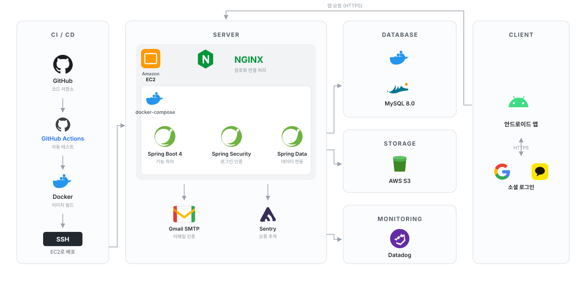
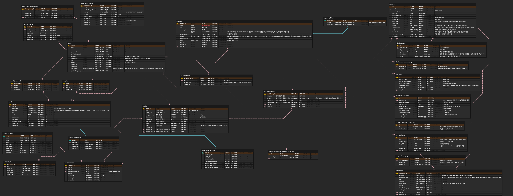

# Hampouch Server

Hampouch 프로젝트의 백엔드 서버 레포지토리입니다.

사용자의 지출 기록과 분석, 절약 챌린지, 햄배틀, 미니 챌린지, 커뮤니티, 회원 인증 및 마이페이지 기능을 제공합니다.

## 🧱 Tech Stack

| Category | Technology | Version |
| --- | --- | --- |
| Language | Java | 21 |
| Framework | Spring Boot | 4.1.0 |
| ORM | Spring Data JPA / Hibernate | - |
| Build Tool | Gradle | 9.7 |
| Database | MySQL | 8.0 |
| Migration | Flyway | - |
| Authentication | Spring Security, JWT, Google/Kakao OAuth | - |
| Storage | AWS S3 | - |
| Infra | AWS EC2, Docker Compose, Nginx | - |
| Monitoring | Datadog, Sentry | - |
| API Docs | SpringDoc OpenAPI, Swagger UI | 3.1.0 |
| CI/CD | GitHub Actions | - |

## 🏗 Server Architecture



## 🗃 ERD




## 📁 Project Structure

```text
src/main/java/Hampouch/server
├── domain
│   ├── auth          # 회원가입, 로그인, 이메일 인증, 토큰, 비밀번호 재설정
│   ├── battle        # 햄배틀 생성, 참가, 조회 및 결과 처리
│   ├── challenge     # 절약 챌린지 생성, 현황, 캘린더, 결과 및 추천
│   ├── community     # 게시글, 댓글, 좋아요, 북마크 및 이미지
│   ├── expense       # 지출 기록, 무지출 기록, 이미지 및 지출 분석
│   ├── minichallenge # 미니 챌린지 추천 및 수행 기록
│   ├── rest          # 사용자 휴식 및 복귀
│   └── user          # 마이페이지, 프로필, 닉네임, 비밀번호, 알림 설정
└── global
    ├── common        # 공통 응답 및 예외 처리
    ├── config        # 공통 설정
    ├── filter        # 요청 필터
    ├── jwt           # JWT 생성 및 검증
    ├── openapi       # Swagger 설정
    └── security      # Spring Security 설정
```

DB 스키마는 Flyway 마이그레이션으로 관리합니다.

```text
src/main/resources/db/migration
```


## 🚀 Local Quick Start

### 1. 프로젝트 클론

```bash
git clone https://github.com/Hampouch/Hampouch-Server.git
cd Hampouch-Server
```

### 2. 환경변수 설정

```bash
cp .env.example .env
```

생성한 `.env` 파일에 필요한 값을 입력합니다.

### 3. Docker Compose 실행

```bash
docker compose --env-file .env up -d --build
```

실행 상태와 로그를 확인합니다.

```bash
docker compose ps
docker compose logs -f app
```

서버는 기본적으로 다음 주소에서 실행됩니다.

```text
http://localhost:8080
```

종료할 때는 다음 명령을 사용합니다.

```bash
docker compose down
```

DB 데이터까지 삭제하려면 다음 명령을 사용합니다.

```bash
docker compose down -v
```

## 🧪 Test

H2 기반 기본 테스트를 실행합니다.

```bash
./gradlew test
```

Testcontainers와 실제 MySQL 8.0을 사용하는 테스트를 실행합니다.

```bash
./gradlew mysqlTest
```

전체 검증을 실행합니다.

```bash
./gradlew clean check mysqlTest
```

`mysqlTest` 실행 시 Docker 데몬이 실행 중이어야 합니다.

## 📚 API Docs

https://api.hampouch.com/swagger-ui/index.html#/


## 🌿 Branch & Collaboration

| Branch | Purpose |
| --- | --- |
| `main` | 운영 배포 브랜치 |
| `develop` | 통합 개발 브랜치 |
| `feat/*` | 기능 개발 |
| `fix/*` | 버그 수정 |
| `chore/*` | 설정 및 유지보수 |

### Workflow

1. 작업 이슈 생성
2. `develop`에서 작업 브랜치 생성
3. 기능 구현 및 테스트
4. `develop` 대상으로 Pull Request 생성
5. CI 및 코드 리뷰 통과 후 병합
6. 배포 시 `develop → main` Pull Request 생성
7. `main` 병합 후 운영 배포

## 🚢 Deployment

`main` 브랜치에 변경 사항이 병합되면 GitHub Actions를 통해 운영 배포가 실행됩니다.

운영 환경은 AWS EC2, Docker Compose, Nginx로 구성되어 있습니다.

배포 과정에서 애플리케이션 이미지 생성, EC2 전송, 컨테이너 실행 및 상태 검증이 진행되며, 검증에 실패하면 이전 이미지로 롤백됩니다.
